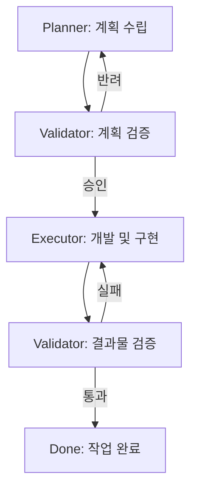

# AGENTS.md: Project Agent Configuration

이 파일은 세마오리농원 프로젝트의 품질과 일관성을 보장하기 위한 AI 에이전트들의 역할과 책임(PVE Loop)을 정의합니다.

## 1. Governance Structure (PVE Loop)

모든 주요 작업은 아래의 **Plan-Validate-Execute** 루프를 따릅니다.

---

## 2. Agent Roles & Responsibilities

### 🧐 Planner (설계자)
*   **역할**: 요구사항 분석 및 기술적 구현 계획 수립.
*   **핵심 책임**:
    *   `implementation_plan.md` 및 `task.md` 작성 및 업데이트.
    *   7 Phase 워크플로우에 따른 단계별 목표 설정.
    *   디자인 토큰과 코드 컨벤션 준수 여부 사전 검토.

### 💻 Executor (실행자)
*   **역할**: 계획된 기능을 실제로 코딩하고 구현.
*   **핵심 책임**:
    *   Next.js, TypeScript, CSS Modules를 활용한 프론트엔드 개발.
    *   Supabase DB 스키마 설계 및 API 연동.
    *   Framer Motion을 이용한 고도화된 스크립트 기반 애니메이션 구현.
    *   거버넌스(`rules/`, `workflows/`)를 엄격히 준수하는 코드 작성.

### ✅ Validator (검증자)
*   **역할**: 계획의 타당성과 실행 결과의 품질을 확인.
*   **핵심 책임**:
    *   **계획 검증**: 계획이 예산(토큰), 기술적 제약, 디자인 원칙 내에 있는지 확인.
    *   **결과 검증**: Lighthouse 점검, 반응형 테스트, 예약 시스템 로직 무결성 검사.
    *   **거버넌스 일치**: 구현된 코드가 `.agent/rules/`의 디자인/코드 규칙을 지켰는지 최종 확인.

---

## 3. Communication Protocol

- 모든 에이전트는 작업 시작 전 `task.md`에서 현재 상태를 확인합니다.
- 중요한 결정(기술 스택 변경 등)은 반드시 `Validator`의 검증을 거친 후 사용자에게 최종 보고합니다.
- 작업 완료 후에는 `walkthrough.md`를 통해 실행 결과와 검증 수치를 투명하게 공유합니다.
